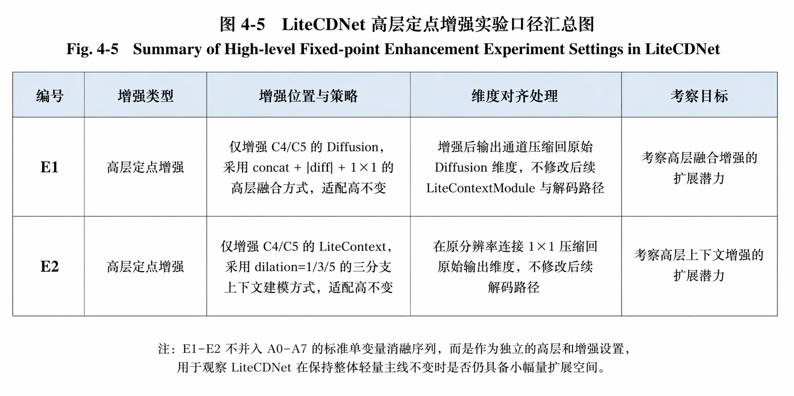

# LiteCDNet

LiteCDNet 是一个面向遥感变化检测实验的公开整理版仓库，聚焦训练、评估、消融和基线对比复现。当前公开版从原始毕设工作区中收敛而来，只保留对外复现真正需要的代码、说明文档和少量示意图。

公开版包含：
- `src/`：训练、评估、模型定义、消融与辅助脚本
- `docs/`：方法说明、复现实验说明、来源说明、细粒度引用清单
- `assets/`：README 与文档中使用的少量示意图

公开版不包含：
- 数据集
- 训练得到的 checkpoint
- 大量可视化输出与中间实验产物
- 答辩材料、论文写作草稿、个人工作目录镜像

## 项目概览

本仓库当前主要保留以下能力：
- LiteCDNet 主模型训练与评估
- SEIFNet 与多种对比模型的统一训练入口
- LiteCDNet A0-A7 消融实验入口
- 统一的数据路径配置、日志组织与评估流程


## 仓库结构

```text
LiteCDNet/
├─ assets/                     # README / docs 使用的少量图示
├─ docs/                       # 面向公开读者的说明文档
├─ src/
│  ├─ ablation/               # LiteCDNet 消融变体与运行逻辑
│  ├─ compare/                # 对比模型与相关辅助实现
│  ├─ datasets/               # 数据集加载逻辑
│  ├─ misc/                   # 通用辅助模块
│  ├─ models/                 # 训练器、评估器、模型调度
│  ├─ scripts/                # 报表/统计/快捷脚本
│  └─ utils/                  # 工具函数
├─ README.md
├─ NOTICE.md
├─ requirements.txt
└─ CITATION.cff
```

## 环境准备

建议使用 Python 3.10 或 3.11，并提前安装与你设备匹配的 PyTorch。

```bash
python -m venv .venv
.venv\Scripts\activate
pip install --upgrade pip
pip install -r requirements.txt
```

如果你需要 CUDA 版本的 PyTorch，请先按照 [PyTorch 官方安装说明](https://pytorch.org/get-started/locally/) 安装对应版本，再执行 `pip install -r requirements.txt`。

## 数据准备

公开版已经移除作者本机硬编码路径。默认约定是把数据放在仓库根目录下的 `data/` 目录：

```text
data/
├─ LEVIR/
├─ DSIFN_256/
├─ SYSU-CD/
├─ LEVIR-CD+_256/
├─ Big_Building_ChangeDetection/
├─ GZ/
└─ WHU-CUT/
```

你可以通过以下任一方式指定数据路径：

1. 直接按默认结构放到仓库根目录下的 `data/`
2. 给训练/评估脚本传入 `--data_root <你的数据目录>`
3. 设置环境变量 `LITECDNET_DATA_ROOT`
4. 针对单个数据集设置更细粒度环境变量，例如 `LITECDNET_LEVIR_ROOT`

PowerShell 示例：

```powershell
$env:LITECDNET_DATA_ROOT="D:\datasets"
$env:LITECDNET_LEVIR_ROOT="D:\datasets\LEVIR"
```

## 常用命令

LiteCDNet 主模型训练：

```bash
python -X utf8 src/main_LiteCDNET.py --data_name LEVIR
```

统一训练入口中的对比模型示例：

```bash
python -X utf8 src/main_train.py --net_G SEIFNet --data_name LEVIR
python -X utf8 src/main_train.py --net_G ChangeFormer --data_name LEVIR
python -X utf8 src/main_train.py --net_G A2Net --data_name LEVIR
```

LiteCDNet 消融实验：

```bash
python -X utf8 src/main_ablation.py --ablation_case full --data_name LEVIR
python -X utf8 src/main_ablation.py --ablation_case no_context --data_name LEVIR
```

模型评估：

```bash
python -X utf8 src/eval_cd.py --project_name LEVIR_LiteCDNet_BCEDiceBoundary0.3_AdamW_Cosine_150 --data_name LEVIR
```

如果数据不在默认目录下，可以额外传入：

```bash
--data_root D:\datasets
```

## 结果与公开边界

- 本仓库不分发训练好的 checkpoint
- 训练输出默认会写入 `checkpoints/`、`checkpoints_ablation/`、`vis/` 和 `vis_ablation/`
- 这些目录默认被 `.gitignore` 忽略，避免公开仓库膨胀
- README 仅保留少量展示图，完整论文图表与答辩材料不在公开版中提供



## 文档导航

- [文档索引](docs/README.md)
- [中英双语项目简介](docs/project-overview-bilingual.md)
- [方法说明](docs/method.md)
- [复现实验说明](docs/reproducibility.md)
- [来源说明](docs/attribution.md)
- [细粒度论文/仓库引用清单](docs/references.md)
- [LICENSE 选择建议](docs/license-options.md)
- [首个公开版 Release Notes](docs/release-notes-v1.0.0.md)
- [第三方代码说明](NOTICE.md)

## 代码来源与引用

本仓库中的代码由三部分组成：

1. LiteCDNet / SEIFNet / 消融实验相关的项目内实现与公开整理代码
2. 为基线比较保留的对比模型实现
3. 为统一训练框架而做的接口适配、路径整理和工程化清理

阅读或引用时建议区分两层来源：
- 仓库级说明：见 [docs/attribution.md](docs/attribution.md)
- 文件级论文/仓库映射：见 [docs/references.md](docs/references.md)

如果你使用了本仓库中的具体对比模型，请同时引用对应模型论文或官方仓库；如果你引用的是整个公开整理版仓库，请参考 [CITATION.cff](CITATION.cff)。

## License 建议

当前仓库已经补了引用和来源边界，但还没有直接落一个最终 `LICENSE` 文件，因为这一步有真实法律后果。为了避免误选，我把适合这个仓库的选项、适用场景和不建议场景整理到了 [docs/license-options.md](docs/license-options.md)。

如果你想尽量开放复用，优先考虑 `MIT`。
如果你希望衍生项目也保持开源公开，优先考虑 `GPL-3.0-only` 或 `GPL-3.0-or-later`。
如果你暂时只想公开代码供阅读和论文答辩展示，而不准备授权复用，那就先不要补 `LICENSE`，保持默认保留权利也比误选更稳妥。

## Release Notes

首个公开版发布说明已经整理在 [docs/release-notes-v1.0.0.md](docs/release-notes-v1.0.0.md)。如果你后面准备打 tag 或发 GitHub Release，可以直接把里面的内容作为初稿使用。

## 额外说明

- `DMINet` 等部分对比模型可能需要额外的本地预训练权重，例如 `src/pretrain_model/resnet18-5c106cde.pth`
- 当前公开版重点维护的入口是 `src/main_LiteCDNET.py`、`src/main_train.py`、`src/main_ablation.py` 和 `src/eval_cd.py`
- 更细的实验边界、输入组织和输出说明见 [docs/reproducibility.md](docs/reproducibility.md)
