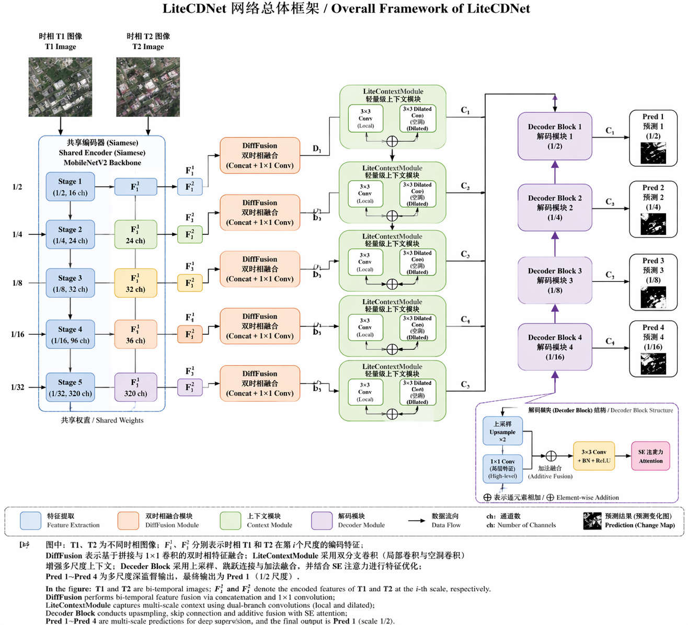
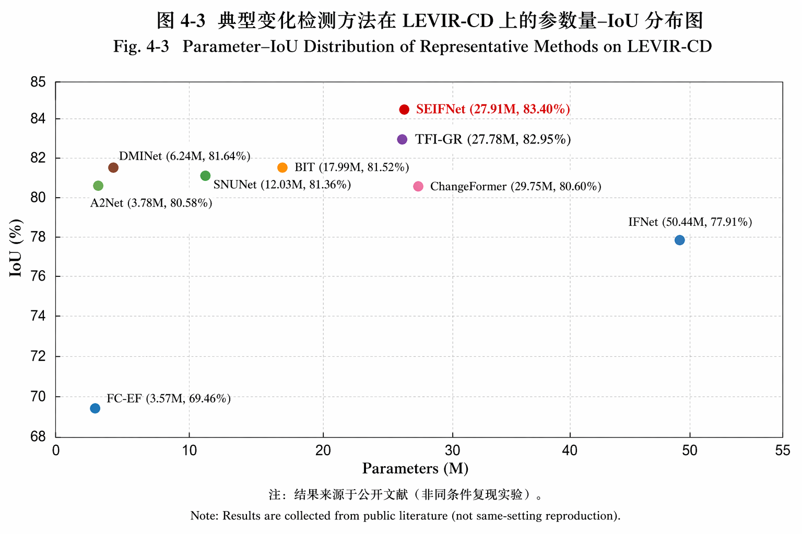
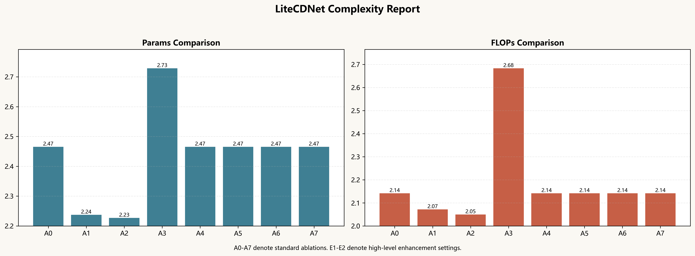
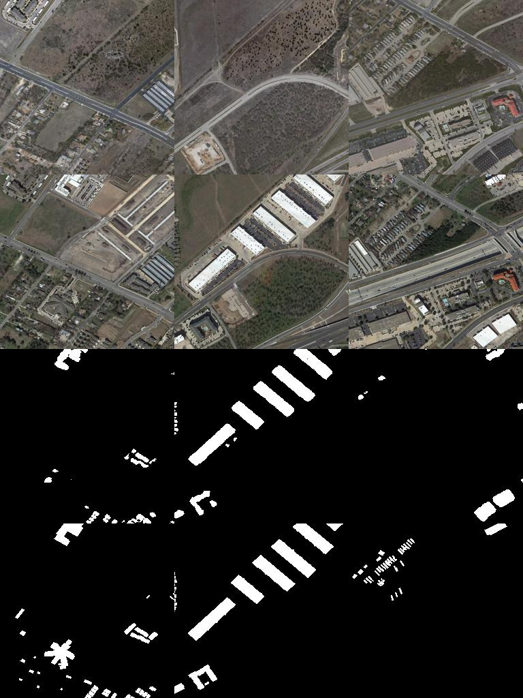

# LiteCDNet — 遥感变化检测

> 轻量遥感变化检测 PyTorch 训练、评估与消融实验框架

[](https://www.python.org/)
[](https://pytorch.org/)
[](https://github.com/2002yy/LiteCDNet)
[](#9-license--notes)

---

## 1. 项目一句话定位

LiteCDNet 是一个面向遥感影像双时相变化检测实验的公开整理版 PyTorch 仓库。其核心贡献是提出了一种轻量化变化检测网络 LiteCDNet（仅 2.47M 参数、2.14G FLOPs），并提供了一套完整的训练、评估、A0-A7 消融实验体系以及 SEIFNet、A2Net、ChangeFormer 等多模型对比基线。仓库来源于作者本科毕业设计实验代码的收敛与工程化清理，目标是以可复现的方式展示研究方法、模型组织方式和训练流程。

## 2. Screenshots / Demo

### LiteCDNet 网络架构



### LEVIR-CD 参数-精度对比



### 复杂度总览



### 单样本预测示例 (LEVIR-CD)



> 待补充截图：A0-A7 消融摘要（已有 `assets/ablation-summary.png`，可自行查看）

运行训练后可查看 TensorBoard/WandB 可视化结果：

```bash
tensorboard --logdir checkpoints/
```

默认训练输出会写入 `checkpoints/`、`vis/` 等目录，运行时生成实时指标与预测图。

## 3. Tech Highlights

| 类别 | 技术 / 组件 | 版本 | 用途说明 |
| --- | --- | --- | --- |
| **框架** | PyTorch | >= 2.0 | 深度学习训练与推理框架 |
| **视觉** | torchvision | >= 0.15 | 图像处理与数据增强 |
| **日志** | TensorBoard / tensorboardX | >= 2.6 | 训练指标可视化 |
| **指标** | thop | >= 0.1.1 | FLOPs 与参数量统计 |
| **调度** | timm | >= 0.9 | 学习率调度与优化器辅助 |
| **数据** | opencv-python / Pillow | >= 4.8 / >= 10.0 | 图像 I/O 与预处理 |
| **计算** | numpy / scikit-learn | >= 1.24 / >= 1.3 | 数值计算与评估指标 |
| **辅助** | einops / tqdm / matplotlib | — | 张量重排、进度条、结果绘图 |

**核心亮点：**

- **轻量变化检测网络** — LiteCDNet 仅 2.47M 参数、2.14G FLOPs，在 LEVIR-CD 上达到 0.97837 Acc / 0.81035 mIoU
- **A0-A7 消融实验体系** — 覆盖 DiffFusion、LiteContext、Decoder、Boundary Loss、Deep Supervision 等关键模块的逐项分析
- **SEIFNet 等多模型对比基线** — 统一训练入口支持 SEIFNet、A2Net、ChangeFormer、IFNet、SNUNet 等 10+ 对比模型
- **完整复现文档** — 提供方法说明、复现指南、来源说明与细粒度引用映射

## 4. Architecture / Code Map

### 仓库整体结构

```text
LiteCDNet/
├─ assets/                     # README / docs 使用的少量图示
├─ docs/                       # 面向公开读者的说明文档
│  ├─ README.md               # 文档索引
│  ├─ project-overview-bilingual.md  # 中英双语项目简介
│  ├─ method.md               # LiteCDNet 方法与模型结构概览
│  ├─ reproducibility.md      # 环境、数据组织、训练与评估复现说明
│  ├─ attribution.md          # 仓库级代码来源说明与适配边界
│  ├─ references.md           # 细粒度文件 -> 论文 / 官方仓库映射清单
│  ├─ license-options.md      # LICENSE 选择建议
│  └─ release-notes-v1.0.0.md # 首个公开版发布说明
├─ publications/               # 公开版论文副本 (DOCX / PDF)
├─ src/
│  ├─ main_LiteCDNET.py       # LiteCDNet 主模型训练入口
│  ├─ main_train.py           # SEIFNet 等对比模型统一训练入口
│  ├─ main_ablation.py        # A0-A7 消融实验统一入口
│  ├── main_ablation_*.py     # 各消融变体独立入口
│  ├─ eval_cd.py              # LiteCDNet 主模型评估入口
│  ├─ data_config.py          # 数据路径解析与数据集目录映射
│  ├─ ablation/               # 消融变体定义、复杂度统计与运行器
│  │  ├─ litecdnet_variants.py
│  │  ├─ complexity.py
│  │  ├─ presets.py
│  │  └─ runner.py
│  ├─ compare/                # 对比模型与相关辅助实现
│  │  ├─ LiteCDNET.py        # LiteCDNet 主模型实现
│  │  ├─ SEIFNet (in networks.py) # 核心基线模型
│  │  ├─ A2Net.py / A2Net_v2.py
│  │  ├─ ChangeFormer.py
│  │  ├─ FC_EF.py / FC_Siam_conc.py / FC_Siam_diff.py
│  │  ├─ IFNet.py / DASNet.py / DTCDSCN.py
│  │  ├─ SNUNet.py / NestedUNet.py
│  │  ├─ Changer.py
│  │  ├─ DMINet.py / TFI_GR.py
│  │  └─ MobileNet.py / resnet.py / resnet_tfi.py / resbase.py
│  ├─ datasets/
│  │  └─ CD_dataset.py        # 变化检测数据集读取逻辑
│  ├─ misc/
│  │  ├─ imutils.py
│  │  └─ logger_tool.py
│  ├─ models/
│  │  ├─ networks.py          # 模型调度与SEIFNet等项目核心实现
│  │  ├─ trainer.py           # 训练流程封装
│  │  ├─ evaluator.py         # 评估流程封装
│  │  └─ losses.py            # 损失函数定义
│  └─ utils/
│     └─ metrics.py           # 常用指标计算工具
├─ NOTICE.md                   # 第三方代码使用边界说明
├─ CITATION.cff                # 仓库级引用入口
├─ requirements.txt
└─ README.md
```

### 核心入口一览

| 文件 / 目录 | 角色说明 |
| --- | --- |
| `src/main_LiteCDNET.py` | LiteCDNet 主模型训练入口 |
| `src/eval_cd.py` | LiteCDNet 主模型评估入口 |
| `src/main_train.py` | SEIFNet、A2Net、ChangeFormer 等对比模型统一训练入口 |
| `src/main_ablation.py` | A0-A7 消融实验统一入口 |
| `src/compare/LiteCDNET.py` | LiteCDNet 主模型网络实现 |
| `src/models/networks.py` | 模型调度与 `SEIFNet` 等核心网络定义 |
| `src/models/trainer.py` | 训练流程封装 |
| `src/models/evaluator.py` | 评估流程封装 |
| `src/models/losses.py` | 损失函数定义 |
| `src/datasets/CD_dataset.py` | 变化检测数据集读取逻辑 |
| `src/data_config.py` | 数据路径解析与数据集目录映射 |
| `src/utils/metrics.py` | 常用指标计算工具 |
| `src/ablation/` | 消融变体、复杂度统计与运行器 |
| `src/compare/` | 全部对比模型实现 |
| `docs/` | 方法说明、复现指南、来源说明、引用清单 |

### 方法概览

LiteCDNet 面向双时相遥感影像变化检测任务：输入同一区域两个时间点的影像，输出像素级变化掩码。公开版保留的核心模块包括：

- 轻量级主干与双时相特征提取
- 差异特征融合模块 (DiffFusion)
- 上下文增强模块 (LiteContext)
- 解码恢复与多尺度监督
- 边界感知损失 (Boundary Loss)

详见 [docs/method.md](docs/method.md)。

## 5. Quick Start

### 环境准备

建议 Python 3.10 或 3.11，提前安装与设备匹配的 PyTorch。

```bash
# 创建虚拟环境
python -m venv .venv
source .venv/bin/activate  # Linux/Mac
# .venv\Scripts\activate   # Windows

# 安装依赖
pip install --upgrade pip
pip install -r requirements.txt
```

如果需要 CUDA 版本 PyTorch，先按 [PyTorch 官方说明](https://pytorch.org/get-started/locally/) 安装对应版本，再执行 `pip install -r requirements.txt`。

### 数据准备

默认约定数据放在仓库根目录下 `data/` 目录：

```text
data/
├─ LEVIR/
├─ DSIFN_256/
├─ SYSU-CD/
├─ LEVIR-CD+_256/
├─ Big_Building_ChangeDetection/
├─ GZ/
└─ WHU-CUT/
```

数据路径可以通过以下任一方式指定（优先级递增）：

1. 默认结构 `data/`（仓库根目录下）
2. `--data_root <你的数据目录>`
3. 环境变量 `LITECDNET_DATA_ROOT`
4. 单数据集环境变量 `LITECDNET_LEVIR_ROOT` 等

示例：

```powershell
$env:LITECDNET_DATA_ROOT="D:\datasets"
$env:LITECDNET_LEVIR_ROOT="D:\datasets\LEVIR"
```

### 训练主模型

```bash
python -X utf8 src/main_LiteCDNET.py --data_name LEVIR
```

### 训练对比模型

```bash
python -X utf8 src/main_train.py --net_G SEIFNet --data_name LEVIR
python -X utf8 src/main_train.py --net_G ChangeFormer --data_name LEVIR
python -X utf8 src/main_train.py --net_G A2Net --data_name LEVIR
```

### 运行消融实验

```bash
python -X utf8 src/main_ablation.py --ablation_case full --data_name LEVIR
python -X utf8 src/main_ablation.py --ablation_case no_context --data_name LEVIR
```

### 评估模型

```bash
python -X utf8 src/eval_cd.py --project_name LEVIR_LiteCDNet_BCEDiceBoundary0.3_AdamW_Cosine_150 --data_name LEVIR
python -X utf8 src/eval_cd.py --project_name LEVIR_LiteCDNet_BCEDiceBoundary0.3_AdamW_Cosine_150 --checkpoint_name best_ckpt.pt --data_name LEVIR
```

数据不在默认目录时追加 `--data_root D:\datasets`。

### 推荐首次入门路线

1. 安装依赖：`pip install -r requirements.txt`
2. 放置数据
3. 训练主模型：`python -X utf8 src/main_LiteCDNET.py --data_name LEVIR`
4. 评估：`python -X utf8 src/eval_cd.py --project_name LEVIR_LiteCDNet_BCEDiceBoundary0.3_AdamW_Cosine_150 --data_name LEVIR`
5. 阅读方法说明 [docs/method.md](docs/method.md) 与复现说明 [docs/reproducibility.md](docs/reproducibility.md)

### LEVIR-CD 主结果

| Model | FLOPs (G) | Params (M) | Acc | mIoU | mF1 | IoU(change) | F1(change) | Precision(change) | Recall(change) |
| --- | --- | --- | --- | --- | --- | --- | --- | --- | --- |
| SEIFNet | 8.37 | 27.91 | 0.97821 | 0.80942 | 0.88507 | 0.64151 | 0.78161 | 0.79851 | 0.76541 |
| **LiteCDNet** | **2.14** | **2.47** | **0.97837** | **0.81035** | **0.88575** | **0.64321** | **0.78287** | **0.80127** | **0.76530** |

- LiteCDNet 的 FLOPs 和 Params 来自本地前向统计
- SEIFNet 数据用于公开结果对照展示

### A0-A7 消融实验

| Code | Setting | Params (M) | FLOPs (G) | Best val mIoU | Best val mF1 | Delta mIoU vs A0 |
| --- | --- | --- | --- | --- | --- | --- |
| **A0** | Full LiteCDNet | 2.47 | 2.14 | 0.81628 | 0.88959 | — |
| A1 | `abs_diff` replaces DiffFusion | 2.24 | 2.07 | 0.76093 | 0.84729 | -0.05535 |
| A2 | Remove LiteContext | 2.23 | 2.05 | 0.81338 | 0.88749 | -0.00290 |
| A3 | Concat decoder | 2.73 | 2.68 | 0.82246 | 0.89403 | +0.00618 |
| A4 | Remove boundary loss | 2.47 | 2.14 | 0.79182 | 0.87144 | -0.02446 |
| A5 | Remove deep supervision | 2.47 | 2.14 | 0.80894 | 0.88425 | -0.00734 |
| A6 | `boundary=0.5` | 2.47 | 2.14 | 0.80940 | 0.88459 | -0.00688 |
| A7 | Adjust multi-scale loss weights | 2.47 | 2.14 | 0.81207 | 0.88656 | -0.00421 |

> A0-A7 采用统一验证集口径用于模块贡献分析，不等同于上面 LEVIR-CD 主测试结果表。

详见 [docs/reproducibility.md](docs/reproducibility.md)。

## 6. Testing / CI

**待补充。** 仓库当前以训练脚本的直接运行作为验证手段，尚未引入自动化测试框架与 CI 流水线。

自动化测试与持续集成待后续版本补充。

## 7. Release / Download

当前最新版本：**v1.0.0**（首个公开整理版）

- [GitHub Releases 页面](https://github.com/2002yy/LiteCDNet/releases)
- 仓库克隆：`git clone https://github.com/2002yy/LiteCDNet.git`
- 安装依赖：`pip install -r requirements.txt`
- [公开版论文 DOCX](publications/LiteCDNet_thesis_public_redacted.docx)
- [公开版论文 PDF](publications/LiteCDNet_thesis_public_redacted.pdf)

### 发布说明摘要 (v1.0.0)

**包含：**
- 公开版目录重组（`src/`、`docs/`、`assets/`）
- LiteCDNet 主模型训练与评估入口
- SEIFNet 与多个对比模型统一训练入口
- LiteCDNet A0-A7 消融实验相关代码
- 新增公开版 README、文档索引、复现说明、方法说明
- 新增数据路径配置层（移除本机绝对路径依赖）
- 新增来源说明、细粒度引用清单、NOTICE 与 CITATION.cff

**不包含：**
- 数据集
- Checkpoint 权重
- 大量可视化输出
- 论文写作草稿、答辩材料和个人工作目录

见 [docs/release-notes-v1.0.0.md](docs/release-notes-v1.0.0.md)。

## 8. Roadmap

- [x] LiteCDNet 主模型训练与评估入口
- [x] SEIFNet 与 A2Net、ChangeFormer、IFNet 等多模型统一训练入口
- [x] A0-A7 完整消融实验体系（DiffFusion、LiteContext、Decoder、Boundary Loss、Deep Supervision 等）
- [x] 统一数据路径配置（支持 `--data_root`、环境变量、默认目录）
- [x] 公开版文档体系（方法说明、复现指南、来源说明、引用映射）
- [x] LICENSE 选择建议与分析
- [x] 首个公开版 Release (v1.0.0)

- [ ] 补充自动化测试与 CI 流水线
- [ ] 提供预训练 Checkpoint 下载链接
- [ ] 细化更多数据集的训练配置示例
- [ ] 增加预测结果批量可视化脚本
- [ ] 完善 WandB 集成与实验追踪
- [ ] 补充更丰富的 Demo Notebook / Colab

## 9. License / Notes

### License

当前仓库采用 **MIT License**。详见 `LICENSE` 文件。

对于 `src/compare/` 中基于公开论文或仓库整理的对比模型实现，请同时尊重其上游许可与引用要求。顶层许可证不替代 `docs/attribution.md`、`docs/references.md` 和 `NOTICE.md` 中的来源说明。

### 代码来源说明

本仓库代码由三部分组成：

1. **项目内原创实现** — LiteCDNet、SEIFNet、消融实验、公开整理代码及文档
2. **基线对比保留代码** — 基于已有论文或公开仓库整理到统一训练框架中的项目内适配版本
3. **工程化适配** — 接口统一、路径整理与数据组织

对比模型文件应理解为"基于原论文/公开实现整理到本仓库训练框架中的实验版本"，而非全部从零独立原创的全新模型。使用某个对比模型时，请同时引用其原始论文或官方仓库。

- 仓库级来源说明：[docs/attribution.md](docs/attribution.md)
- 细粒度文件 -> 论文 / 仓库映射：[docs/references.md](docs/references.md)
- 第三方代码边界：[NOTICE.md](NOTICE.md)
- 仓库引用：[CITATION.cff](CITATION.cff)
- 许可证选择说明：[docs/license-options.md](docs/license-options.md)

### 补充说明

- `DMINet` 等部分对比模型可能需要额外的本地预训练权重（如 `src/pretrain_model/resnet18-5c106cde.pth`）
- 训练输出写入 `checkpoints/`、`checkpoints_ablation/`、`vis/`、`vis_ablation/`，均被 `.gitignore` 忽略
- 公开版已移除作者本机硬编码路径，所有数据路径可配置
- 推荐首先关注的主入口：`src/main_LiteCDNET.py`、`src/main_train.py`、`src/main_ablation.py`、`src/eval_cd.py`

### 文档导航

| 文档 | 说明 |
| --- | --- |
| [docs/README.md](docs/README.md) | 文档索引 |
| [docs/project-overview-bilingual.md](docs/project-overview-bilingual.md) | 中英双语项目简介 |
| [docs/method.md](docs/method.md) | LiteCDNet 方法与模型结构概览 |
| [docs/reproducibility.md](docs/reproducibility.md) | 环境、数据、训练与评估复现说明 |
| [docs/attribution.md](docs/attribution.md) | 仓库级代码来源说明与适配边界 |
| [docs/references.md](docs/references.md) | 细粒度文件 -> 论文 / 官方仓库映射 |
| [docs/license-options.md](docs/license-options.md) | LICENSE 选择建议 |
| [docs/release-notes-v1.0.0.md](docs/release-notes-v1.0.0.md) | 首个公开版发布说明 |
| [NOTICE.md](NOTICE.md) | 第三方代码使用边界 |
| [CITATION.cff](CITATION.cff) | 仓库级引用配置 |

### 致谢

本仓库来源于作者本科毕业设计期间的实验代码收敛与工程化清理，感谢指导老师与答辩组的建议与支持。对比模型部分基于对应论文或公开仓库做了项目内适配，感谢各开源社区与论文作者的贡献。
